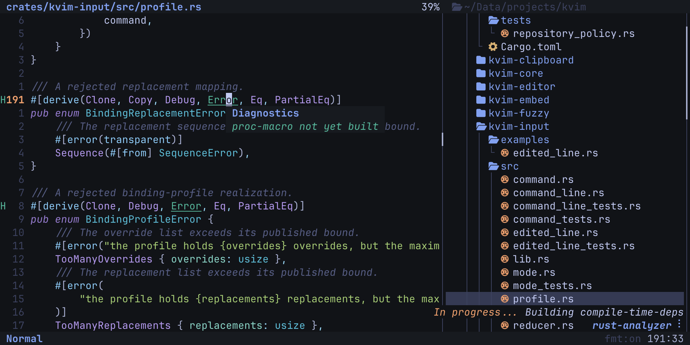

# kvim

kvim is a modal terminal editor for Rust projects on macOS and Linux. It
provides Vim-style editing, workspace navigation, fuzzy search, Tree-sitter
highlighting, language server support, and format-on-save in one executable.



## Install

### With Cargo

kvim requires Rust 1.94.1 or newer.

```sh
cargo install --git https://github.com/ko1N/kvim.git --locked kvim
```

Cargo usually installs `kvim` in `~/.cargo/bin`. Install optional external
tools separately.

### With Nix

Run kvim without installing it:

```sh
nix run github:ko1N/kvim
```

Install kvim into your profile:

```sh
nix profile install github:ko1N/kvim
```

The Nix package includes `git`, `rg`, and `rust-analyzer` on the executable
search path. To build or develop from a checkout, use `nix build` or
`nix develop`.

## Use

Open a file, or start with an empty buffer:

```sh
kvim src/main.rs
kvim
```

`Space` is the leader key. Press it and wait half a second to show available
key sequences. Run `kvim --help` for command-line help and `kvim --version` for
the installed version.

## Diagnostics

Run this command when a feature is unavailable:

```sh
kvim --diagnostics
```

The report shows the kvim version, workspace root, external tool status,
clipboard support, and resource limits. Use `:diagnostics` to open the same
report inside the editor.

## External Tools

External tools are optional. kvim reports a missing tool and remains usable.

| Tool | Enables |
|---|---|
| `git` | Repository status in the file tree. |
| `rg` | Workspace text search with `Space f/`. |
| Language server | Diagnostics, definitions, hover information, and some formatting. |
| Formatter | Format-on-save for supported languages. |
| Clipboard command | Copy and paste between kvim and other applications. |

Install the language server and formatter for each language that you use. For
example, Rust uses `rust-analyzer`. See
[`docs/language-services.md`](docs/language-services.md) for the complete tool
list.

## Clipboard

kvim uses `pbcopy` and `pbpaste` on macOS. On Linux, it tries `wl-copy` and
`wl-paste`, then `xclip`, then `xsel`. Without these commands, yank and paste
continue to work through the internal register.

## License

kvim is available under the [MIT License](LICENSE).
